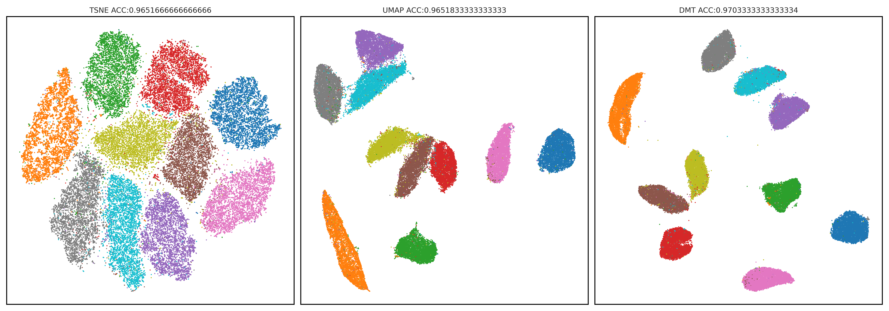
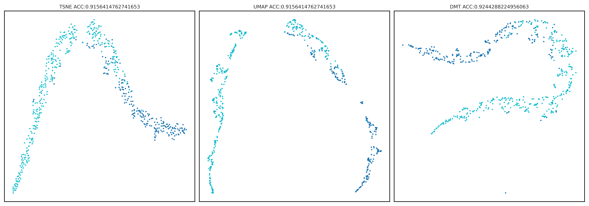
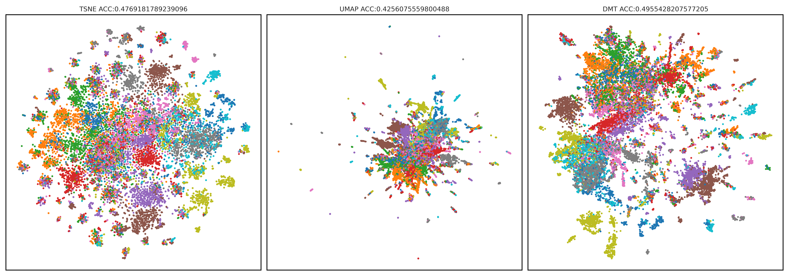
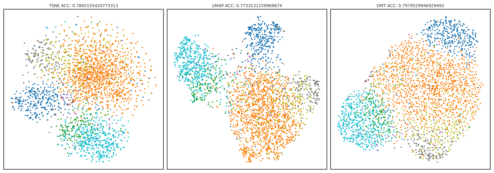

# DMT-EV: An Explainable Deep Network for Dimension Reduction

The code includes the following modules:
* Training
* Inference
* Comparison with t-SNE, UMAP and PCA


## Requirements

* torch>=2.3.1
* torchaudio>=2.3.1
* torchvision>=0.18.1
* pytorch-lightning==2.4.0


## Installation
Create a new conda environment and install torch, torchvision, torchaudio:
```bash
conda create -n DMT python=3.10
conda activate DMT
pip install torch==2.3.1 torchvision==0.18.1 torchaudio==2.3.1 --index-url https://download.pytorch.org/whl/cu121
```
Then you can install the package from source or from PyPI.
Install from source:
```bash
pip install -e git+https://github.com/Westlake-AI/DMT-learn.git#egg=dmt-learn
```
Install from PyPI:
```bash
pip install dmt-learn
```

## Running the code
Use the following code to fit the model to the dataset and visualize the results.

```python
import numpy as np
import matplotlib.pyplot as plt
from sklearn.datasets import load_iris
from dmt import DMT

# Load sample dataset
iris = load_iris()
X = iris.data
y = iris.target

# Perform t-SNE
dmt = DMT(num_fea_aim=100)
X_dmt = dmt.fit_transform(X)

# Plot the result
plt.figure(figsize=(8, 6))
scatter = plt.scatter(X_dmt[:, 0], X_dmt[:, 1], c=y, cmap='viridis')

# Create legend
legend1 = plt.legend(*scatter.legend_elements(), title="Classes")
plt.gca().add_artist(legend1)  # Add the legend to the current axes

plt.title('DMT-EV visualization of Iris dataset')
plt.xlabel('DMT-EV Component 1')
plt.ylabel('DMT-EV Component 2')
plt.savefig('dmt.png')
```
You can alse separate the training and inference steps:
```python
dmt.fit(X)
X_dmt = dmt.transform(X)
```
If you want to compare the results with other dimension reduction methods(t-SNE, UMAP), you can use the following code:
```python
dmt.compare(X, "comparison.png")
```

## Example Results

The code is in [example](https://github.com/zangzelin/example_dmtlearn.git).

### Mnist Dataset



### breast_cancer Dataset



### 20News Dataset



### PBMC Dataset




## Cite the paper

```
@article{zang2024dmt,
  title={DMT-EV: An Explainable Deep Network for Dimension Reduction},
  author={Zang, Zelin and Cheng, Shenghui and Xia, Hanchen and Li, Liangyu and Sun, Yaoting and Xu, Yongjie and Shang, Lei and Sun, Baigui and Li, Stan Z},
  journal={IEEE Transactions on Visualization and Computer Graphics},
  volume={30},
  number={3},
  pages={1710--1727},
  year={2024},
  publisher={IEEE}
}
```


## License

EVNet is released under the MIT license.
